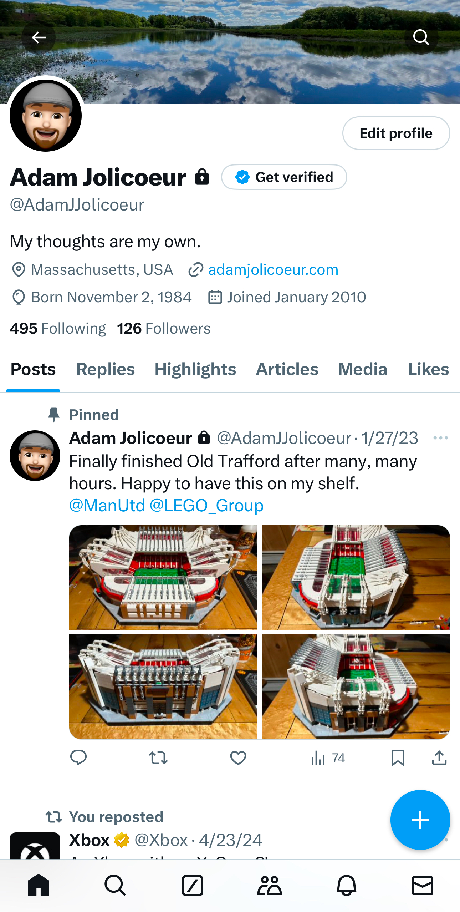

Removed the Twitter (never called or calling it "X") specific `<meta>` information from my site. I finally requested an archive of all of my activity from over the years and will be deleting my account as soon as that information arrives. Maybe I'll move all of that history over to [Bluesky](https://bsky.app/profile/adamjol.bsky.social)?

